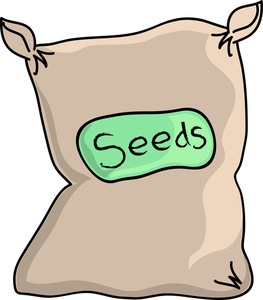

# Seed

A simple bundler like library for Golang that syncs files to a specific directory from various VCS repos.
Supports git,svn,hg,bzr.

This is meant to be used within an application and not to sync code dependencies.

This is alpha quality, do not use.  I am surprised this even works.

Currently the only feature supported is syncing repos

Example Seed file
```
  get github.com/logicminds/puppet-retrospec, ref: master
  get github.com/logicminds/micro-puppet, ref: master


```

## Todo
* Add error handling
* Finish writing the code
* Create a lexar to parse the seed file instead of regex
* Support Concurrent repo syncs
* add namespace feature around repos
* add seedpath feature aroudn namespace

## Usage

```go

   import "github.com/logicminds/seed"

   func main() {
     seed.Sync_Seed_File("/tmp", "Seedfile")
   }

   Fetching github.com/logicminds/puppet-retrospec...
   Fetching github.com/logicminds/puppet-micro...

```



